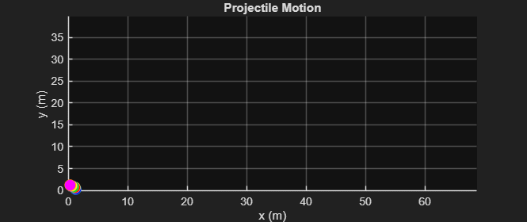

# Projectile Motion Simulation

## Purpose
This MATLAB project simulates the trajectories of multiple projectiles launched at different angles with the same initial velocity. It demonstrates fundamental physics concepts, trajectory plotting, and dynamic visualization in MATLAB.

## Description
- Models 5 projectiles with varying launch angles (15°, 30°, 45°, 60°, 75°).  
- Calculates horizontal and vertical motion under gravity (`g = 9.8 m/s²`).  
- Animates projectile positions in real-time with markers and trails showing their trajectories.  
- Provides a visual comparison of how launch angle affects range and maximum height.

## Files
- `projectile.m` → Main MATLAB simulation script  
- `Figures/` → Optional folder for saved screenshots or trajectory plots  

## Key Concepts
- Kinematics and projectile motion equations  
- Numerical simulation of time-dependent motion  
- MATLAB plotting, animation, and trajectory visualization  
- Understanding effect of launch angle on projectile range and height

## How to Run
1. Open `projectile.m` in MATLAB.  
2. Run the script to see animated trajectories of all five projectiles.  
3. Observe differences in flight paths caused by varying angles.

## Notes
- Initial velocity, angles, gravity, and time step can be adjusted for experimentation.  
- The simulation stores the trajectories in arrays `X` and `Y` for plotting continuous trails.

