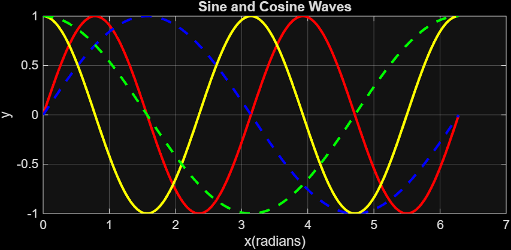

# Sine and Cosine Waves Simulation

## Purpose
This MATLAB project demonstrates the generation and visualization of sine and cosine functions with varying frequencies, helping to understand wave behavior and trigonometric concepts.

## Description
- Plots four functions over the interval 0 to 2π:  
  - `y1 = sin(2x)` → red solid line  
  - `y2 = sin(x)` → blue dashed line  
  - `y3 = cos(2x)` → yellow solid line  
  - `y4 = cos(x)` → green dashed line  
- Illustrates how amplitude, frequency, and phase affect wave shape.  
- Uses MATLAB plotting features, including line styles, colors, and grid formatting.  

## Files
- `sincos.m` → MATLAB script  
- `Figures/` → Optional folder for screenshots of plotted waves  

## Key Concepts
- Trigonometric functions and their properties  
- Plotting multiple functions in MATLAB  
- Line styles, colors, and visual differentiation  
- Data visualization and presentation in MATLAB  

## How to Run
1. Open `sincos.m` in MATLAB.  
2. Run the script to generate a plot of the four sine and cosine waves.  
3. Observe differences in frequency and line style between the waves.

## Notes
- The interval and step size can be adjusted to increase resolution.  
- Line styles and colors can be customized for clarity or presentation purposes.

